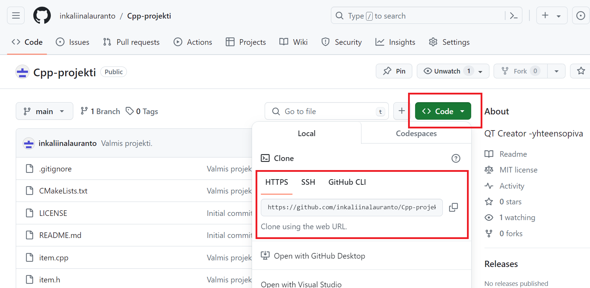
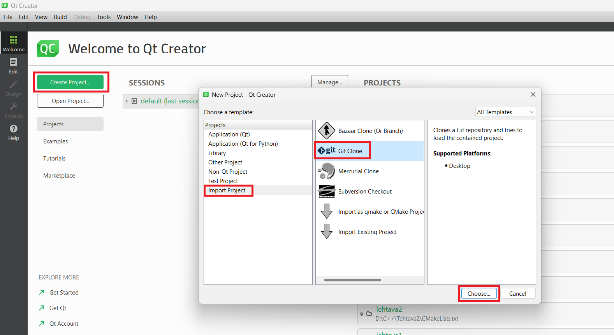
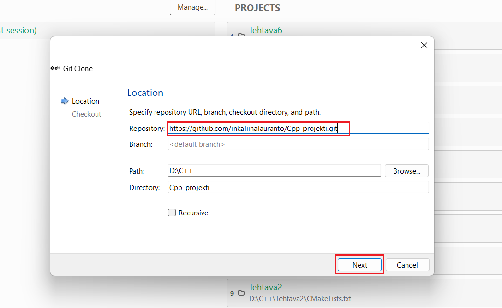
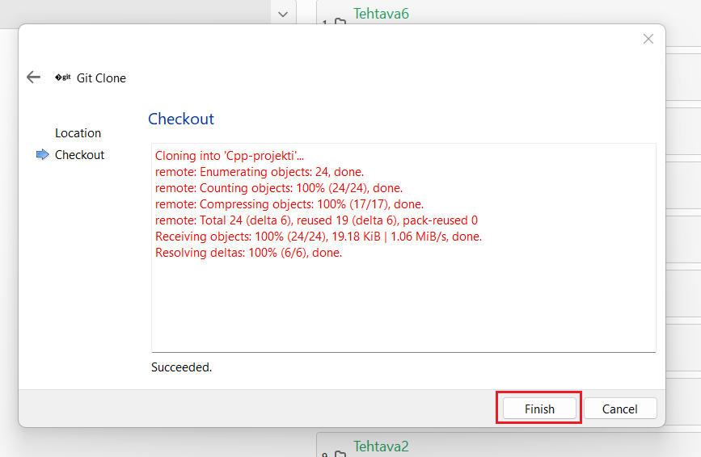
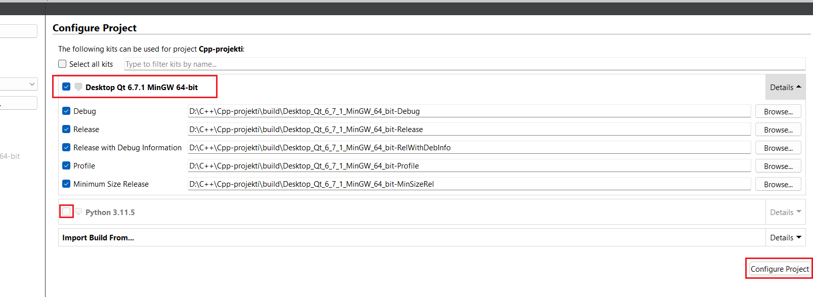
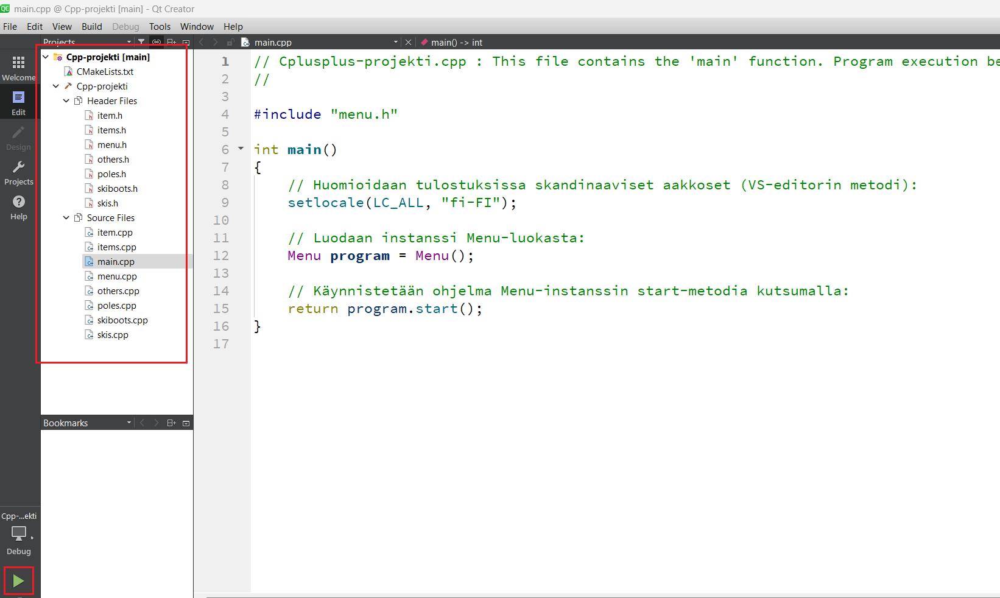
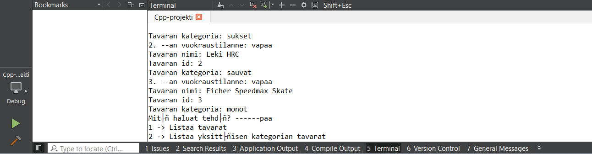
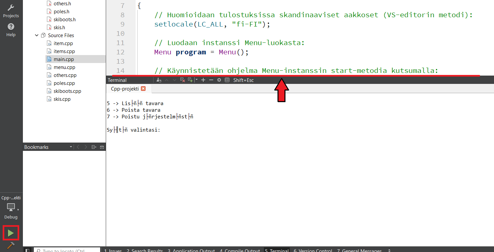
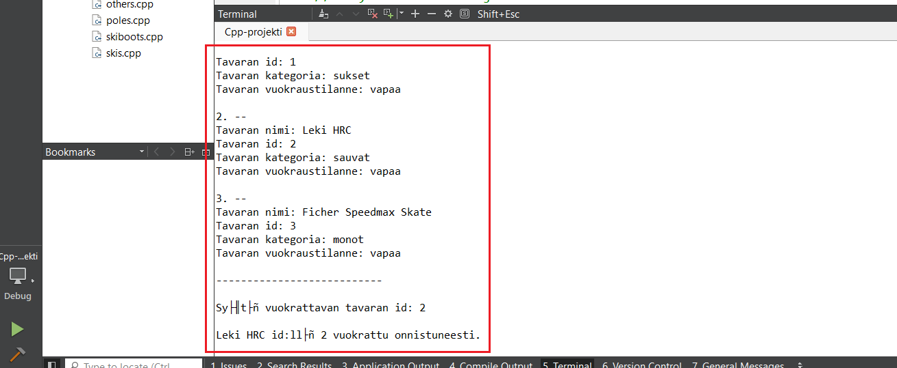

# Cpp-projekti

## Projektin kuvaus:
Projektin lopputuote on yksinkertainen hiihtotarvikkeiden ylläpitojärjestelmä, jossa tavarat voi listata kokonaisuudessaan tai kategorioittain, niitä voi vuokrata ja palauttaa sekä lisätä ja poistaa. Käyttöliittymänä projektissa toimii komentokehoiterajapinta, joka ohjaa käyttäjää koko järjestelmän käynnissäoloajan.

Pääohjelma- eli main.cpp-tiedostossa hyödynnetään Menu-luokasta tehtyä instanssia. Menu-luokan lisäksi ohjelmaan kuuluvat Item-luokka, Items-luokka, jossa tehdään instansseja Item-luokasta, sekä Items-luokasta periytyvät Others-, Poles-, SkiBoots- ja Skis-luokat.

Jokaisessa luokassa koodi on jaettu pienempiin osiin jäsenfunktioiksi. Lisäksi periytyvissä luokissa hyödynnetään perittyjä funktioita sekä ylikirjoitettavaa perittyä funktiota. Useassa luokassa käytetään C++ -kielen standardikirjastoja, kuten vector-, string-, iostream- ja fstream-kirjastoja. Tavaratiedot esimerkiksi kirjoitetaan tiedostoon ja luetaan sieltä fstream-kirjaston ominaisuuksia hyödyntämällä. Ohjelma on kommentoitu yksityiskohtaisesti.

## Projektin tarkasteleminen QT Creator -editorilla (Windows-käyttöjärjestelmällä):
- Jos käytät Visual Studio 2022 -editoria, siirry seuraavan linkin takana olevaan repositorioon ja seuraa ko. repositorion README-tiedostosta löytyviä ohjeita: https://github.com/inkaliinalauranto/Cplusplus-projekti
- Kopioi leikepöydälle repositorion URL <> Code -napista avautuvan pikku ikkunan HTTPS-otsikon alapuolella olevasta kentästä:

- Avaa QT Creator, ja paina Create Project... -nappia. Napista avautuvan New Project -ikkunan Projects-kohdan alta valitse Import project -kohta, minkä jälkeen valitse Git Clone. Paina Choose... -nappia (Jotta kloonaaminen onnistuu, on mahdollista, että QT Creatorissa on käytävä täyttämässä tiedot Preferences-kohdan ja edelleen Version Control -kohdan Git-välilehdeltä löytyvään Prepend to Path -kenttään. Kenttään täytetään tiedostopolku Git-asennuksen bin-kansioon.):

- Liitä leikepöydältä repositorion URL-osoite Repository-tekstin vieressä olevaan kenttään. Muut tarvittava tiedot täyttyvät automaattisesti, mutta esimerkiksi Path-tiedostosijainnin voi valita Browse... -napista halutessaan. Paina Next-nappia:

- Kun kloonaus on valmis, paina Finish-nappia:

- Configure Project -kohdassa valitse Dektop Qt -sanoilla alkava vaihtoehto eli kohdat Debug, Release, Release with Debug Information, Profile ja Minimum Size Release on oltava valittuina. Jätä sen sijaan valinta pois Python-kohdasta. Paina lopuksi Configure Project -nappia:

- Nyt projektin pitäisi latautua ongelmitta. Play-nappia painamalla ohjelman pitäisi käynnistyä:

- Ohjelman formatointi saattaa näyttää rikkinäiseltä, kun sille annetaan käyttäjäsyötteitä:

- Asian saa korjattua vetämällä terminaalin ylälaitaa ylöspäin heti sen jälkeen, kun ohjelman on käynnistänyt play-napista:

- Sen jälkeen ohjelman ulosanti formatoituu, kuten pitää. Terminaalin ylälaidan ylös- tai alaspäinveto on tehtävä aina, kun ohjelman ajaa alusta. 
- Vaikka koodi on kirjoitettu englanniksi, on käyttöliittymä suomen kielellä. Editori ei tunnista skandinaavisia merkkejä, joten niiden tilalle generoituu muita erikoismerkkejä.
- Ohjelman käyttö onnistuu terminaaliin tulostuvaa opastusta seuraamalla. Muista painaa enter-näppäintä valitsemasi numeron/vaihtoehdon syöttämisen jälkeen:

## Demonstraatio ohjelman toiminnasta:

Ohjelman toimintaa esittelevä esimerkkivideo löytyy seuraavan linkin takaa: https://youtu.be/zqf3zYUio9o
